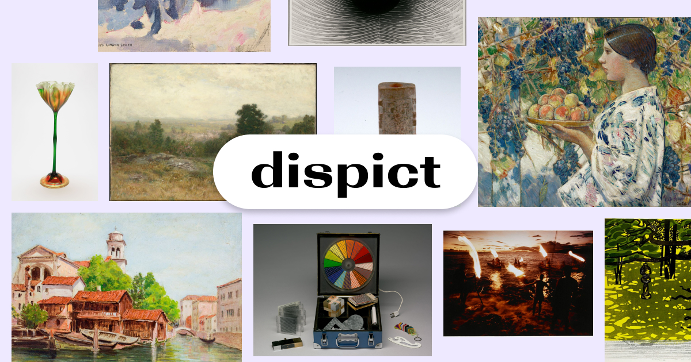

# Dispict: a creative aesthetics tool

Design a growing artistic exhibit of your own making. Bring your own labels and
context.

[](https://dispict.com)

**[dispict.com](https://dispict.com)** greets you with a blank canvas. You begin
typing. Your writing becomes a _label_, and related artworks of the past appear
spatially around the text you wrote. As you pan and zoom, you can add additional
labels to see how the artwork shifts in aesthetic quality.

Focus on a single work to see context: creator, setting, history, and
descriptions. This allows you to learn more about the human essence of the
artwork being presented.

## Motivation

There's currently a lot of excitement about computers helping us find
inspiration by generating original art pieces from text prompts
([1](https://openai.com/dall-e-2/), [2](https://www.midjourney.com/),
[3](https://stability.ai/blog/stable-diffusion-public-release)). But these lose
the genuine, unique part of walking through an art museum where every work has
been lovingly created by humans, and the viewer is surrounded by _insight_ and
_intention_. What if computers could help us connect with great works done by
artists of the past?

The Harvard Art Museums' online collection is huge, containing over 200,000
digitized works. This is far more than can be easily taken in by a single
person. So instead, we apply computation to what it's good at: finding patterns
and connections.

**Creativity and curiosity require associative thinking.** Just like the
technological innovations of centuries past have changed the aesthetic character
of fine art from literal portraiture to more flexible modes of self-expression,
_Dispict_ hopes to be technology that explores the honest, intimate relationship
of humans to the creative process.

## Technical Details

_Dispict_ uses real-time machine learning. It's built on contrastive
language-image pretraining with OpenAI's CLIP and nearest-neighbor search,
served from Python (on a [Modal](https://modal.com/) endpoint) with a dynamic
[Svelte](https://svelte.dev/) frontend.

### Development

If you want to hack on dispict yourself, you can run the frontend development
server locally using [Node v16](https://nodejs.org/) or higher:

```shell
npm install
npm run dev
```

This will automatically connect to the serverless backend recommendation system
hosted on Modal. If you want to change this part of the code, you need a Modal
account, then install [Python 3.10+](https://www.python.org/) and follow these
steps:

1. Run the Jupyter notebooks `notebooks/load_data.ipynb` and
   `notebooks/data_cleaning.ipynb` to download data from the Harvard Art
   Museums. This will produce two files named `data/artmuseums[-clean].json`.
2. Run `python main.py embed-images` to spawn a parallel Modal job that
   downloads and embeds all images in the dataset using
   [CLIP](https://openai.com/blog/clip/), saving the results to
   `data/embeddings.hdf5`.
3. Run `modal app deploy main.py` to create your webhook, which then gives you a
   public URL such as `https://ekzhang-dispict-suggestions.modal.run`.

You can start sending requests to the URL to get recommendations. For example,
`GET /?text=apple` will find artwork related to apples, such as the image shown
below.

<p align="center">
<a href="https://harvardartmuseums.org/collections/object/230725">

</a>
</p>

If you'd like to point the web application at your URL, you can set an
environment variable to override the existing backend.

```shell
VITE_APP_API_URL=https://[your-app-endpoint].modal.run npm run dev
```

## Acknowledgements

Created by Eric Zhang ([@ekzhang1](https://twitter.com/ekzhang1)) for
[Neuroaesthetics](https://mbb.harvard.edu/) at Harvard. All code is licensed
under [MIT](LICENSE), and data is generously provided by the
[Harvard Art Museums](https://www.harvardartmuseums.org/) public access
collection.

I learned a lot from Jono Brandel's [_Curaturae_](https://curaturae.com/) when
designing this.
